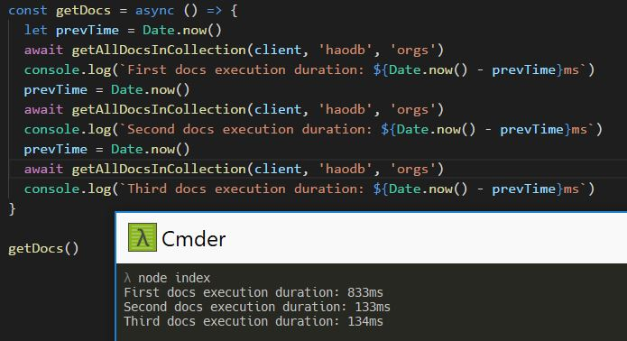

# Cosmos DB SQL (DocumentDB)

** This library is an enhancement library for the `documentdb` npm package **
** It is not yet completely interface-matched with the documentdb library yet.  Still a WIP. **

## Features
### All function calls returns a promise
With promises, you can easily chain your otherwise callback-hellish calls into a more linear fashion.  
You can even use `async/await` to get your docs
```js
//... set up your documentdb client
const sql = require('cosmosdb-sql')()
const {getAllDocsInCollection} = sql
const getDocs = async () = {
  const docs = await getAllDocsInCollection(client, 'dbName', 'myCollectionName')
  //... do stuff with your docs
}

getDocs()
```

### Essential Memoized functions
Some like database and collection links can be memoized for faster execution.  the library will not query cosmos to get the db and collection links required to make the document-level calls within the same request.



### Functional (no classes)
You don't have to worry about `this` or setting context.  You just pass the parameters necessary to make the call, and let the function do the work for you.  The documentdb `client` is required on each function, but you can easily curry the function for easy reusability. There is a convenience function `curryClient` in this library. 

```js
//... set up your documentdb client
const { getAllDocsInCollection, curryClient } = require('cosmosdb-sql')
const allDocsIn = curryClient(getAllDocsInCollection, curry)

const getDocs = async () = {
  const docs = await allDocsIn('dbName', 'myCollectionName')
  //... do stuff with your docs
}

getDocs()

```

